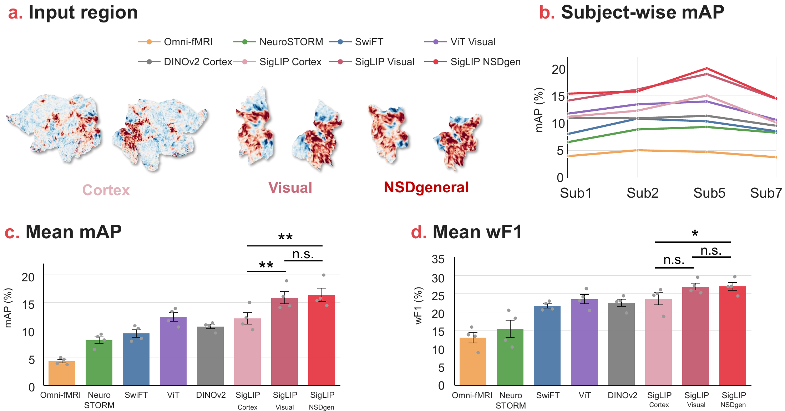

<div align="center">

# FlatClip

### A Geometry-Aware Surface-Level Baseline for fMRI Representation Learning

**NeurIPS 2026**

[Mo Wang](https://openreview.net/profile?id=~Mo_Wang4),
[Wenhao Ye](https://openreview.net/profile?id=~Wenhao_Ye3),
[Zihan Ning](https://openreview.net/profile?id=~Zihan_Ning1),
[Jiayu Zuo](https://openreview.net/profile?id=~Jiayu_Zuo1),
[Junfeng Xia](https://openreview.net/profile?id=~Junfeng_Xia2),
[Hongkai Wen](https://openreview.net/profile?id=~Hongkai_Wen1)<sup>*</sup>,
[Quanying Liu](https://openreview.net/profile?id=~Quanying_Liu1)<sup>*</sup>

Southern University of Science and Technology · University of Warwick · Shenzhen University

[Image Encoder](https://huggingface.co/google/siglip2-base-patch16-naflex) ·
[Quick Start](#quick-start) ·
[NSD Pipeline](#nsd-visual-fmri) ·
[Downstream Probes](#downstream-probes) ·
[Citation](#citation)

</div>

FlatClip converts cortical activity into flatmap images, extracts features with a
**frozen SigLIP2 encoder**, and trains a lightweight downstream probe. It provides
a surface-level reference between ROI summaries and voxel-based fMRI models,
without fMRI-specific encoder pretraining.

<p align="center">
  
</p>

**Figure 3.** Visual-fMRI recognition on NSD: cortical input regions, subject-wise
mAP, and mean mAP / weighted F1 across four subjects.

| Stage | Input | Output |
|---|---|---|
| Surface rendering | Cortical fMRI time series or stimulus-response maps | RGB flatmap images |
| Frozen image encoding | Flatmap images | SigLIP2 frame or stimulus features |
| Downstream readout | Cached features and task labels | Subject-level or COCO80 predictions |

## Quick Start

The commands below use a bash-compatible shell.

### 1. Install

```bash
git clone https://github.com/OneMore1/FlatClip.git
cd FlatClip
conda create -n flatclip python=3.11 -y
conda activate flatclip
pip install -r requirements.txt
pip install transformers==4.57.3 huggingface_hub
```

Use a PyTorch build compatible with your GPU/CUDA environment. Rendering requires
registered cortical surfaces and a configured [Pycortex](https://gallantlab.org/pycortex/)
filestore. The scripts start from surface data: fsLR CIFTI time series for HCP-style
inputs, or paired cortical response arrays for NSD.

### 2. Download the image encoder

FlatClip reuses Google's image-pretrained weights. **There is no separate FlatClip
encoder checkpoint to download**, and no model weights are stored in this repository.

| Backbone | Official model / download | Use |
|---|---|---|
| SigLIP2-Base-Patch16-NaFlex | [Model card](https://huggingface.co/google/siglip2-base-patch16-naflex) · [Model files](https://huggingface.co/google/siglip2-base-patch16-naflex/tree/main) | Default frozen encoder; 768-dimensional features |

Download the model **and its processor/tokenizer files** into a local directory:

```bash
hf download google/siglip2-base-patch16-naflex \
  --local-dir checkpoints/siglip2-base-patch16-naflex

export FLATCLIP_CHECKPOINT_ROOT="$PWD/checkpoints/siglip2-base-patch16-naflex"
```

`FLATCLIP_CHECKPOINT_ROOT` points directly to that checkpoint directory. The
extractors load local files; they do not download weights during feature extraction.

### 3. Generate resting-state flatmaps

Render the first 40 frames of an fsLR cortical CIFTI time series:

```bash
python -m preprocessing.hcp_flatmaps \
  --dtseries-root '<path-to-dtseries>' \
  --filestore '<path-to-pycortex-filestore>' \
  --pycortex-subject HCP_S1200_32k \
  --out-dir outputs/flatmaps/hcp \
  --start-tr 0 --max-tr 40 \
  --norm-mode global-zscore \
  --fixed-vmin -3 --fixed-vmax 3 \
  --height 384 --cmap inferno
```

The filestore must contain the named surface subject, with vertex ordering matching
the input data. Output images are grouped by recording:

```text
outputs/flatmaps/hcp/
  <recording-tag>/
    frame_000000.png
    ...
    frame_000039.png
```

### 4. Extract frozen features

```bash
python -m inference.rest_features \
  --model-family siglip2 --variant naflex \
  --input-root outputs/flatmaps/hcp \
  --output-root outputs/features/hcp \
  --no-resize-original \
  --batch-size 32 --num-workers 4 \
  --device cuda --save-dtype float32
```

Feature files are written to
`outputs/features/hcp/siglip2/naflex/<recording-tag>.npz`.
Use `--device cpu` for CPU extraction. Recording-directory names must be unique
within an extraction run.

| NPZ key | Shape | Meaning |
|---|---|---|
| `cls` | `(T, 768)` | Global image feature for each frame; `T=40` above |
| `image_embeds` | `(T, 768)` | Same global feature exposed under the encoder's image-embedding name |
| `frame_names` | `(T,)` | Frame order used during extraction |
| `metadata` | JSON string | Encoder variant and extraction settings |

The main resting-state probe averages the frame-wise `cls` features into one
768-dimensional subject feature.

## NSD Visual-fMRI

The NSD path uses **stimulus-level GLM response maps**. Each surface NPZ contains
`lh` and `rh` arrays with 32,492 fsLR vertices per hemisphere. Files follow the
`sub1_<nsd_id>.npz` naming convention. ROI-mask NPZ files contain boolean arrays
named `left` and `right` in the same vertex order.

### Render whole-cortex or masked responses

```bash
python -m preprocessing.nsd_flatmaps \
  --input-root '<path-to-sub1-surface-npz>' \
  --filestore '<path-to-pycortex-filestore>' \
  --pycortex-subject NSD_fsLR32k \
  --out-dir outputs/flatmaps/nsd/sub1/cortex \
  --norm-mode zscore --zscore-clip 3 \
  --height 384 --cmap RdBu_r
```

For **HCP-MMP visual cortex** or **NSDgeneral**, add
`--roi-mask '<path-to-region-mask.npz>'` and use a separate output directory.
Supply the visual-cortex mask in fsLR32k space. NSDgeneral masks can be generated
from the official NSD resources:

```bash
python -m preprocessing.nsd_masks \
  --nsddata '<path-to-nsddata>' \
  --outdir outputs/masks/nsdgeneral \
  --subjects subj01
```

The cached renderer, `preprocessing/nsd_roi_flatmaps.py`, can reuse existing
`flatmask_384.npz` and `flatverts_384.npz` Pycortex projection caches.

### Extract stimulus features

```bash
python -m inference.nsd_features \
  --input-root outputs/flatmaps/nsd/sub1/cortex \
  --output-file outputs/features/nsd/sub1_cortex.hdf5 \
  --checkpoint "$FLATCLIP_CHECKPOINT_ROOT" \
  --max-num-patches 1024 --output-patch-grid 16 \
  --batch-size 32 --num-workers 4 --device cuda:0
```

The HDF5 file stores `embeddings` with shape `(N, 256, 768)`, `nsd_ids`, and
`source_png`. The 256 tokens are an adaptive `16 x 16` pooling of valid encoder
patch features. Averaging these tokens yields the main 768-dimensional NSD feature.

## Downstream Probes

Only the probe is trained. Both pipelines use cached features and explicit labels
and split information supplied by the user.

### Resting-state classification

```bash
python -m inference.rest_probe \
  --tasks hcp \
  --feature-mode cls_mean_token \
  --hcp-feature-root outputs/features/hcp/siglip2/naflex \
  --hcp-roi-root '<path-to-hcp-split-root>' \
  --hcp-labels '<path-to-hcp-labels.csv>' \
  --out-dir outputs/probes/hcp \
  --hidden-dim 256 --depth 2 --dropout 0.2 \
  --best-metric weighted_f1 --seeds 42,43,44
```

`rest_probe.py` also supports `ppmi`, `adni_mci`, and `adni_ad`. Each task has its
own feature, label, and split arguments; use `python -m inference.rest_probe --help`
to inspect them. HCP labels use `Subject` and `Gender` columns. The HCP/PPMI
adapters infer split membership from the task's ROI-file directory structure;
`--hcp-roi-root` is used to recover subject membership, not as the probe feature input.
For HCP, `Gender` is encoded as `0` or `1`, and the split root contains
`train/`, `val/`, and `test/` folders with subject-identifiable `.npy` filenames.

### NSD COCO80 recognition

```bash
python -m inference.nsd_probe \
  --hdf5-root outputs/features/nsd \
  --hdf5-template '{subject}_cortex.hdf5' \
  --cache-root outputs/cache/nsd \
  --embedding-label cortex \
  --label-dir '<path-to-coco80-labels>' \
  --stim-info '<path-to-nsd-stim-info.csv>' \
  --input-mode one_token --one-token-source patch_mean \
  --regime within --test-subject sub1 \
  --best-metric mAP --seed 42 \
  --out outputs/results/sub1_cortex.json \
  --ckpt outputs/probes/sub1_cortex.pt
```

Use `--cache-only` to prepare the downstream feature arrays without training a
classifier. The main NSD split uses 8,550 training images, 450 validation images,
and 1,000 shared test images per subject. Labels and stimulus metadata must match
the image IDs in the HDF5 file.

## Repository Layout

```text
FlatClip/
  preprocessing/
    hcp_flatmaps.py       # CIFTI-to-flatmap rendering
    nsd_flatmaps.py       # NSD surface rendering
    nsd_masks.py          # NSDgeneral mask construction
    nsd_roi_flatmaps.py   # Cached masked rendering
    npz_io.py             # Surface-array loading
  inference/
    siglip2.py            # Local frozen encoder
    rest_features.py     # Frame-feature extraction
    nsd_features.py      # Stimulus-feature extraction
    rest_probe.py        # Resting-state probes
    nsd_probe.py         # COCO80 probes and feature caching
    nsd_utils.py         # NSD labels and split utilities
  docs/assets/
    figure3.png          # Paper overview figure
  requirements.txt
```

This repository contains the main pipeline. Ablation runners, subject data,
feature caches, and trained weights are not included.

## Citation

```bibtex
@inproceedings{wang2026flatclip,
  title={FlatClip: A Geometry-Aware Surface-Level Baseline for fMRI Representation Learning},
  author={Wang, Mo and Ye, Wenhao and Ning, Zihan and Zuo, Jiayu and Xia, Junfeng and Wen, Hongkai and Liu, Quanying},
  booktitle={Advances in Neural Information Processing Systems},
  year={2026}
}
```

## Acknowledgements

FlatClip builds on [SigLIP2](https://huggingface.co/google/siglip2-base-patch16-naflex),
[Pycortex](https://gallantlab.org/pycortex/), and
[neuromaps](https://netneurolab.github.io/neuromaps/).
Please follow the original model licenses and dataset access agreements.

<sup>*</sup> Correspondence:
[Hongkai Wen](mailto:hongkai.wen@warwick.ac.uk) and
[Quanying Liu](mailto:liuqy@sustech.edu.cn).
